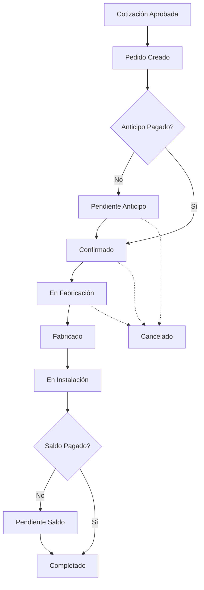

# 🛒 ARQUITECTURA MÓDULO PEDIDOS - SUNDECK

## 🎯 **OBJETIVO DEL MÓDULO**
Crear un módulo comercial completo para gestión de pedidos con enfoque en ventas, seguimiento comercial, notificaciones y análisis de rendimiento.

---

## 📊 **DASHBOARD PRINCIPAL - PEDIDOS**

### **Vista General Comercial:**
```
┌─────────────────────────────────────────────────────────────────┐
│ 🛒 MÓDULO PEDIDOS - DASHBOARD COMERCIAL                        │
├─────────────────────────────────────────────────────────────────┤
│                                                                 │
│ 📈 MÉTRICAS DEL MES                                           │
│ ┌─────────────┬─────────────┬─────────────┬─────────────┐      │
│ │💰 Ventas    │📋 Pedidos   │⏱️ Promedio  │🎯 Meta      │      │
│ │$125,450     │    23       │  12 días    │ 85% ✅      │      │
│ │+15% vs ant. │ +8 nuevos   │ -2 días     │             │      │
│ └─────────────┴─────────────┴─────────────┴─────────────┘      │
│                                                                 │
│ 🔔 NOTIFICACIONES ACTIVAS (8)                                 │
│ • 3 Pedidos pendientes de anticipo                            │
│ • 2 Pedidos listos para fabricación                           │
│ • 1 Pedido con retraso en entrega                             │
│ • 2 Seguimientos comerciales pendientes                       │
│                                                                 │
│ 📋 PEDIDOS RECIENTES                                          │
│ ┌─────────────────────────────────────────────────────────────┐ │
│ │ PED-2025-0023 │ María González │ $18,270 │ Confirmado    │ │
│ │ PED-2025-0022 │ Carlos Ruiz    │ $24,500 │ Fabricación   │ │
│ │ PED-2025-0021 │ Ana López      │ $15,800 │ Instalación   │ │
│ └─────────────────────────────────────────────────────────────┘ │
└─────────────────────────────────────────────────────────────────┘
```

---

## 🏗️ **ESTRUCTURA DE COMPONENTES**

### **1. Dashboard Comercial**
```javascript
// Componentes principales
PedidosDashboard/
├── MetricasComerciales.jsx      // KPIs y métricas
├── NotificacionesActivas.jsx    // Alertas y recordatorios
├── GraficoVentas.jsx           // Gráfico de ventas mensuales
├── PedidosRecientes.jsx        // Lista de pedidos recientes
├── MetasVendedores.jsx         // Progreso de metas por vendedor
└── ResumenFinanciero.jsx       // Estado de pagos y cobranza
```

### **2. Gestión de Pedidos**
```javascript
GestionPedidos/
├── ListaPedidos.jsx            // Tabla completa de pedidos
├── DetallePedido.jsx           // Vista detallada del pedido
├── FormularioPedido.jsx        // Crear/editar pedido
├── SeguimientoPedido.jsx       // Timeline del pedido
├── DocumentosPedido.jsx        // PDFs y archivos
└── HistorialPedido.jsx         // Log de cambios
```

### **3. Sistema de Notificaciones**
```javascript
Notificaciones/
├── CentroNotificaciones.jsx    // Panel principal
├── ConfigNotificaciones.jsx    // Configuración de alertas
├── NotificacionItem.jsx        // Componente individual
└── TiposNotificacion/
    ├── PagosPendientes.jsx     // Alertas de pagos
    ├── EntregasAtrasadas.jsx   // Retrasos en entrega
    ├── SeguimientoComercial.jsx // Follow-ups
    └── CambiosEstado.jsx       // Cambios de estado
```

### **4. Análisis y Reportes**
```javascript
AnalisisComercial/
├── ReporteVentas.jsx           // Reportes de ventas
├── AnalisisVendedores.jsx      // Performance por vendedor
├── TendenciasMercado.jsx       // Análisis de tendencias
├── ProyeccionVentas.jsx        // Proyecciones futuras
└── ExportarReportes.jsx        // Exportación de datos
```

---

## 🔔 **SISTEMA DE NOTIFICACIONES**

### **Tipos de Notificaciones:**

#### **🔴 CRÍTICAS (Acción Inmediata)**
- Pedidos con pagos vencidos (+7 días)
- Entregas atrasadas (+3 días de la fecha programada)
- Pedidos cancelados por el cliente
- Problemas en fabricación que afectan entrega

#### **🟡 IMPORTANTES (Acción en 24-48h)**
- Anticipos pendientes (3-7 días)
- Pedidos listos para siguiente fase
- Seguimientos comerciales programados
- Documentos pendientes de firma

#### **🟢 INFORMATIVAS (Seguimiento)**
- Nuevos pedidos creados
- Cambios de estado exitosos
- Pagos recibidos
- Instalaciones completadas

### **Configuración de Alertas:**
```javascript
const tiposNotificacion = {
  PAGO_VENCIDO: {
    prioridad: 'critica',
    frecuencia: 'diaria',
    destinatarios: ['vendedor', 'supervisor', 'admin'],
    template: 'El pedido {numero} tiene pago vencido desde hace {dias} días'
  },
  ENTREGA_ATRASADA: {
    prioridad: 'critica',
    frecuencia: 'diaria',
    destinatarios: ['vendedor', 'cliente'],
    template: 'Entrega del pedido {numero} atrasada {dias} días'
  },
  ANTICIPO_PENDIENTE: {
    prioridad: 'importante',
    frecuencia: 'cada_2_dias',
    destinatarios: ['vendedor'],
    template: 'Anticipo pendiente del pedido {numero} - Cliente: {cliente}'
  }
};
```

---

## 📊 **MÉTRICAS Y KPIs COMERCIALES**

### **Métricas Principales:**
```javascript
const metricasComerciales = {
  // Ventas
  ventasMes: {
    actual: 125450,
    anterior: 109200,
    meta: 140000,
    progreso: 89.6
  },
  
  // Pedidos
  pedidosMes: {
    total: 23,
    nuevos: 8,
    enProceso: 12,
    completados: 3
  },
  
  // Tiempos
  tiempoPromedio: {
    cotizacionAPedido: 5.2, // días
    pedidoAInstalacion: 12.8, // días
    cicloCompleto: 18.0 // días
  },
  
  // Conversión
  tasaConversion: {
    cotizacionAPedido: 68.5, // %
    pedidoAVenta: 94.2 // %
  },
  
  // Financiero
  cobranza: {
    anticiposPendientes: 45200,
    saldosPendientes: 78900,
    pagosPuntuales: 87.3 // %
  }
};
```

### **Métricas por Vendedor:**
```javascript
const metricasVendedor = {
  carlos: {
    ventasMes: 45200,
    pedidos: 8,
    meta: 50000,
    progreso: 90.4,
    comisiones: 4520,
    clientesNuevos: 3
  },
  maria: {
    ventasMes: 38900,
    pedidos: 6,
    meta: 45000,
    progreso: 86.4,
    comisiones: 3890,
    clientesNuevos: 2
  }
};
```

---

## 🔄 **FLUJO DE ESTADOS DEL PEDIDO**



### **Estados y Responsabilidades:**
```javascript
const estadosPedido = {
  'pendiente_anticipo': {
    responsable: 'vendedor',
    acciones: ['seguimiento_pago', 'contactar_cliente'],
    notificaciones: ['pago_pendiente'],
    tiempoLimite: 7 // días
  },
  'confirmado': {
    responsable: 'vendedor',
    acciones: ['enviar_fabricacion', 'programar_instalacion'],
    notificaciones: ['listo_fabricacion'],
    tiempoLimite: 2 // días
  },
  'en_fabricacion': {
    responsable: 'fabricacion',
    acciones: ['actualizar_progreso'],
    notificaciones: ['progreso_fabricacion'],
    tiempoLimite: null // definido por fabricación
  },
  'fabricado': {
    responsable: 'instalacion',
    acciones: ['programar_instalacion', 'contactar_cliente'],
    notificaciones: ['listo_instalacion'],
    tiempoLimite: 3 // días
  },
  'en_instalacion': {
    responsable: 'instalador',
    acciones: ['completar_instalacion', 'solicitar_saldo'],
    notificaciones: ['instalacion_progreso'],
    tiempoLimite: 1 // día
  },
  'pendiente_saldo': {
    responsable: 'vendedor',
    acciones: ['cobrar_saldo'],
    notificaciones: ['saldo_pendiente'],
    tiempoLimite: 30 // días
  },
  'completado': {
    responsable: null,
    acciones: ['generar_garantia', 'seguimiento_postventa'],
    notificaciones: ['pedido_completado'],
    tiempoLimite: null
  }
};
```

---

## 🎨 **DISEÑO DE INTERFAZ**

### **Paleta de Colores Módulo Pedidos:**
```css
:root {
  /* Comercial - Azules y Dorados */
  --pedidos-primary: #1E40AF;      /* Azul principal */
  --pedidos-secondary: #D4AF37;    /* Dorado */
  --pedidos-success: #10B981;      /* Verde éxito */
  --pedidos-warning: #F59E0B;      /* Amarillo advertencia */
  --pedidos-danger: #EF4444;       /* Rojo crítico */
  --pedidos-info: #3B82F6;         /* Azul información */
  
  /* Estados específicos */
  --estado-pendiente: #F59E0B;
  --estado-confirmado: #10B981;
  --estado-proceso: #3B82F6;
  --estado-completado: #059669;
  --estado-cancelado: #EF4444;
}
```

### **Iconografía:**
```javascript
const iconosPedidos = {
  dashboard: '🛒',
  ventas: '💰',
  pedidos: '📋',
  notificaciones: '🔔',
  clientes: '👥',
  reportes: '📊',
  configuracion: '⚙️',
  
  // Estados
  pendiente: '⏳',
  confirmado: '✅',
  fabricacion: '🔧',
  instalacion: '🏠',
  completado: '🎉',
  cancelado: '❌'
};
```

---

## 📱 **RESPONSIVE Y UX**

### **Breakpoints:**
- **Desktop**: Dashboard completo con todas las métricas
- **Tablet**: Dashboard simplificado, navegación por tabs
- **Mobile**: Vista de lista, acciones rápidas

### **Navegación:**
```javascript
const navegacionPedidos = {
  principal: [
    { path: '/pedidos', label: 'Dashboard', icon: '🛒' },
    { path: '/pedidos/lista', label: 'Todos los Pedidos', icon: '📋' },
    { path: '/pedidos/notificaciones', label: 'Notificaciones', icon: '🔔' },
    { path: '/pedidos/reportes', label: 'Reportes', icon: '📊' }
  ],
  acciones: [
    { action: 'crear', label: 'Nuevo Pedido', icon: '➕' },
    { action: 'buscar', label: 'Buscar', icon: '🔍' },
    { action: 'filtrar', label: 'Filtros', icon: '🔽' },
    { action: 'exportar', label: 'Exportar', icon: '📤' }
  ]
};
```

---

## 🔧 **ARQUITECTURA TÉCNICA**

### **Estructura de Carpetas:**
```
client/src/modules/pedidos/
├── components/
│   ├── dashboard/
│   │   ├── MetricasComerciales.jsx
│   │   ├── GraficoVentas.jsx
│   │   └── NotificacionesPanel.jsx
│   ├── gestion/
│   │   ├── ListaPedidos.jsx
│   │   ├── DetallePedido.jsx
│   │   └── FormularioPedido.jsx
│   ├── notificaciones/
│   │   ├── CentroNotificaciones.jsx
│   │   └── ConfiguracionAlertas.jsx
│   └── reportes/
│       ├── ReporteVentas.jsx
│       └── AnalisisComercial.jsx
├── hooks/
│   ├── usePedidos.js
│   ├── useNotificaciones.js
│   └── useMetricasComerciales.js
├── services/
│   ├── pedidosAPI.js
│   ├── notificacionesAPI.js
│   └── reportesAPI.js
├── utils/
│   ├── formatters.js
│   ├── validators.js
│   └── constants.js
└── styles/
    ├── pedidos.css
    └── dashboard.css
```

### **Estado Global (Redux/Context):**
```javascript
const pedidosState = {
  dashboard: {
    metricas: {},
    notificaciones: [],
    pedidosRecientes: [],
    loading: false
  },
  pedidos: {
    lista: [],
    filtros: {},
    paginacion: {},
    seleccionado: null
  },
  notificaciones: {
    activas: [],
    configuracion: {},
    noLeidas: 0
  },
  reportes: {
    ventas: {},
    vendedores: {},
    tendencias: {}
  }
};
```

---

## 🚀 **PLAN DE IMPLEMENTACIÓN**

### **Fase 1: Dashboard y Métricas**
1. Crear componente Dashboard principal
2. Implementar métricas comerciales
3. Sistema básico de notificaciones
4. Gráficos de ventas

### **Fase 2: Gestión de Pedidos**
1. Lista completa de pedidos
2. Detalle y edición de pedidos
3. Sistema de estados y flujos
4. Documentos y archivos

### **Fase 3: Notificaciones Avanzadas**
1. Centro de notificaciones completo
2. Configuración de alertas
3. Notificaciones en tiempo real
4. Integración con email/SMS

### **Fase 4: Reportes y Análisis**
1. Reportes de ventas detallados
2. Análisis por vendedor
3. Proyecciones y tendencias
4. Exportación de datos

---

## ✅ **DIFERENCIACIÓN CON FABRICACIÓN**

| Aspecto | PEDIDOS (Comercial) | FABRICACIÓN (Técnico) |
|---------|-------------------|---------------------|
| **Color Principal** | 🔵 Azul (#1E40AF) | 🟢 Verde (#10B981) |
| **Enfoque** | Comercial/Ventas | Técnico/Producción |
| **Métricas** | Ventas, Cobranza, Metas | Tiempos, Calidad, Producción |
| **Notificaciones** | Pagos, Seguimientos | Fabricación, Materiales |
| **Usuarios** | Vendedores, Admin | Fabricantes, Supervisores |
| **Información** | Precios, Márgenes | Especificaciones, Instrucciones |

---

**¿Te parece bien esta arquitectura? ¿Quieres que ajuste algo antes de empezar la implementación?**
