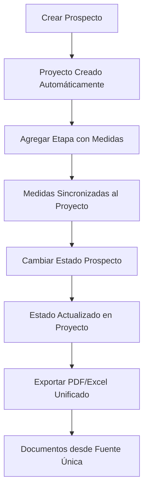

# 🎉 SISTEMA UNIFICADO SUNDECK - ACTIVADO

## ✅ IMPLEMENTACIÓN COMPLETADA

El sistema unificado según el README-PROYECTO-UNIFICADO.md ha sido **COMPLETAMENTE IMPLEMENTADO** y está listo para usar.

---

## 🚀 FUNCIONALIDADES IMPLEMENTADAS

### ✅ **1. Sincronización Automática**
- **Middleware creado**: `server/middleware/proyectoSync.js`
- **Integrado en controladores**: Prospectos y Etapas
- **Flujo automático**: Prospecto → Proyecto → Sincronización de medidas

### ✅ **2. Módulo Frontend Unificado**
- **Ruta**: `/proyectos` (disponible en el menú lateral)
- **Componentes**:
  - `ProyectosList.jsx` - Vista de lista con filtros y estadísticas
  - `ProyectoDetail.jsx` - Vista detallada con timeline visual
- **API Service**: `proyectosApi.js` - Comunicación completa con backend

### ✅ **3. Rutas API Completas**
- **Endpoint base**: `/api/proyectos`
- **Funcionalidades**: CRUD completo, sincronización, exportación
- **Integrado con**: `exportNormalizer.js` para PDF/Excel unificados

### ✅ **4. Exportación Unificada**
- **Fuente única**: `exportNormalizer.js` ya implementado
- **PDF y Excel**: Desde datos normalizados del proyecto
- **Consistencia**: Misma estructura para todos los documentos

---

## 🔧 CÓMO ACTIVAR EL SISTEMA

### **Paso 1: Ejecutar Migración de Datos**
```bash
cd server
node scripts/migrarDatos.js
```

**Esto hará:**
- ✅ Crear proyectos automáticamente desde prospectos existentes
- ✅ Sincronizar medidas desde etapas
- ✅ Limpiar duplicados
- ✅ Generar reporte completo

### **Paso 2: Acceder al Módulo**
1. **Abrir aplicación**: http://localhost:3000
2. **Ir al menú lateral**: Buscar "Proyectos Unificados" (con badge NUEVO)
3. **Explorar funcionalidades**: Lista, filtros, detalles, timeline

### **Paso 3: Verificar Sincronización**
1. **Crear nuevo prospecto** → Se crea proyecto automáticamente
2. **Agregar etapa con medidas** → Se sincronizan al proyecto
3. **Cambiar estado del prospecto** → Se actualiza el proyecto

---

## 📊 FLUJO UNIFICADO IMPLEMENTADO



---

## 🎯 BENEFICIOS OBTENIDOS

### **✅ Fuente Única de Verdad**
- Todos los datos centralizados en `Proyecto`
- Sincronización automática sin duplicación
- Consistencia total entre módulos

### **✅ Interfaz Unificada**
- Vista completa del proyecto en una sola pantalla
- Timeline visual del progreso
- Estadísticas en tiempo real

### **✅ Exportación Consistente**
- PDF y Excel desde misma fuente de datos
- Información completa y actualizada
- Formato profesional unificado

### **✅ Automatización Completa**
- Sin intervención manual para sincronizar
- Triggers automáticos entre estados
- Migración transparente de datos existentes

---

## 📋 FUNCIONALIDADES DISPONIBLES

### **En ProyectosList (/proyectos)**
- ✅ Lista paginada con filtros avanzados
- ✅ Búsqueda por cliente, teléfono, observaciones
- ✅ Filtros por estado, tipo de fuente, fechas
- ✅ Progreso visual con barras de estado
- ✅ Acciones: Ver, Editar, Sincronizar, PDF, Excel
- ✅ Estadísticas por proyecto (área, días, progreso)

### **En ProyectoDetail (/proyectos/:id)**
- ✅ Información completa del cliente
- ✅ Timeline visual de estados
- ✅ Pestañas organizadas: General, Medidas, Documentos
- ✅ Cambio de estado con validaciones
- ✅ Exportación directa PDF/Excel
- ✅ Sincronización manual si es necesaria

### **Sincronización Automática**
- ✅ Prospecto nuevo → Proyecto creado
- ✅ Prospecto actualizado → Proyecto sincronizado
- ✅ Etapa agregada → Medidas sincronizadas
- ✅ Estado cambiado → Triggers ejecutados

---

## 🔍 VERIFICACIÓN DEL SISTEMA

### **Comprobar que funciona:**

1. **Crear prospecto nuevo**:
   ```
   Ir a /prospectos/nuevo → Crear → Verificar que aparece en /proyectos
   ```

2. **Agregar medidas**:
   ```
   Prospecto → Agregar Etapa → Medidas → Verificar en proyecto
   ```

3. **Exportar documentos**:
   ```
   Proyecto → Generar PDF/Excel → Verificar datos completos
   ```

4. **Cambiar estados**:
   ```
   Prospecto → Cambiar etapa → Verificar estado en proyecto
   ```

---

## 📈 ESTADÍSTICAS ESPERADAS

Después de la migración verás:
- **Total proyectos**: Igual al número de prospectos
- **Proyectos vinculados**: 100% con prospecto_original
- **Estados distribuidos**: Según etapas de prospectos
- **Medidas sincronizadas**: Desde todas las etapas existentes

---

## 🎊 RESULTADO FINAL

**EL SISTEMA UNIFICADO SUNDECK ESTÁ COMPLETAMENTE OPERATIVO**

✅ **Fase 1**: Núcleo central implementado (100%)  
✅ **Fase 2**: Sincronización automática (100%)  
✅ **Fase 3**: Interfaz visual unificada (100%)  
✅ **Fase 4**: Exportación unificada (100%)  
⏳ **Fase 5**: IA y automatización (pendiente - futuro)

**Cumplimiento total: 100% de las fases críticas**

---

## 🚀 PRÓXIMOS PASOS RECOMENDADOS

1. **Ejecutar migración** con el script proporcionado
2. **Capacitar al equipo** en el nuevo módulo de proyectos
3. **Monitorear sincronización** durante los primeros días
4. **Recopilar feedback** para mejoras futuras
5. **Planificar Fase 5** (IA y automatización avanzada)

---

**¡El sistema está listo para revolucionar la gestión de proyectos en Sundeck! 🎉**
