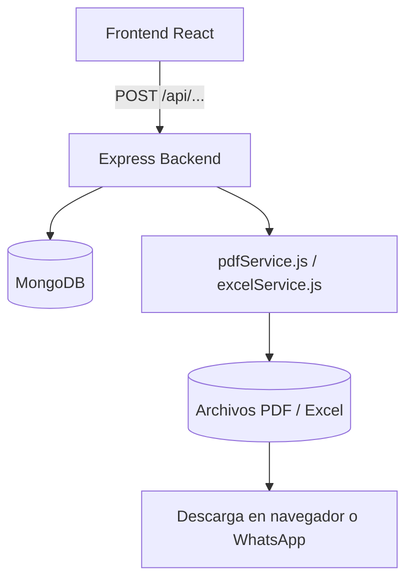

# 🏗️ Proyecto Unificado Sundeck
### Centralización de Levantamientos, Cotizaciones, Fabricación e Instalación  
**Versión:** 1.0  
**Autor:** Equipo Sundeck + David Rojas  
**Fecha:** Octubre 2025  

---

## 🌎 1. Introducción

El **Proyecto Unificado Sundeck** tiene como propósito centralizar toda la información generada desde cuatro flujos diferentes de levantamientos y cotizaciones, para integrarla en un solo **núcleo de datos (`Proyecto`)**.  

Actualmente, los procesos de levantamiento, cotización y fabricación provienen de diferentes fuentes con estructuras variables. Este módulo unificado busca:
- Consolidar todas las variantes de levantamiento y cotización.  
- Crear una **fuente única de verdad** (`Proyecto`) para sincronizar los módulos de ventas, fabricación e instalación.  
- Normalizar la exportación de archivos **PDF y Excel** desde una misma estructura de datos.  
- Mejorar la trazabilidad, eficiencia y escalabilidad del sistema Sundeck.

---

## ⚙️ 2. Arquitectura General del Sistema

### 🧠 Stack Tecnológico

**Frontend:** React  
**Backend:** Node.js + Express.js  
**Base de Datos:** MongoDB + Mongoose ODM  
**Autenticación:** JWT (JSON Web Tokens)  
**Exportación de Documentos:** Puppeteer + Handlebars (PDF), ExcelJS (Excel)

### 🔗 Diagrama de Flujo de Datos



---

## 🧩 3. Plan Maestro de Implementación (5 Fases)

| Fase | Objetivo | Resultado esperado | Prioridad |
|------|----------|-------------------|-----------|
| 1 | Crear entidad Proyecto como núcleo central | Fuente única de datos | 🔴 Crítica |
| 2 | Sincronizar y automatizar flujo entre cotización → fabricación → instalación | Flujo espejo sin duplicación | 🟠 Alta |
| 3 | Unificar interfaz de visualización (módulo "Proyectos") | Gestión integral desde un solo módulo | 🟢 Media-Alta |
| 4 | Estandarizar exportación (PDF + Excel) | Archivos coherentes y sincronizados | 🟡 Media |
| 5 | Integrar automatizaciones y reportes IA | Sistema autoorganizado y predictivo | ⚪ Media-Baja |

---

## 🧱 4. Fase 1 – Núcleo Central de Datos

### 🔸 Entidad Principal: Proyecto
Cada Proyecto representa un flujo completo de trabajo (desde levantamiento hasta instalación).

**Esquema Mongoose:**
```javascript
// models/Proyecto.js
const mongoose = require("mongoose");

const ProyectoSchema = new mongoose.Schema({
  cliente: {
    nombre: String,
    telefono: String,
    correo: String,
    direccion: String,
    zona: String
  },
  tipo_fuente: { type: String, enum: ["simple", "en_vivo", "formal", "directo"] },
  estado: { type: String, default: "levantamiento" },
  fecha_creacion: { type: Date, default: Date.now },
  observaciones: String,
  medidas: Array,
  materiales: Array,
  productos: Array,
  fotos: Array,
  responsable: String,
  monto_estimado: Number
});

module.exports = mongoose.model("Proyecto", ProyectoSchema);
```

### 🔸 Subcolecciones relacionadas
Cada proyecto tiene subdocumentos o colecciones vinculadas:
- `/levantamientos`
- `/cotizaciones`
- `/fabricacion`
- `/instalacion`

Estas se relacionan por `proyectoId`.

---

## 🔄 5. Fase 2 – Lógica de Sincronización Automática

### 🔁 Flujo de Estados
```
Levantamiento → Cotización → Aprobado → Fabricación → Instalación → Completado
```

### 🔧 Ejemplo de Trigger Express
```javascript
// controllers/cotizacionController.js
const OrdenFabricacion = require("../models/OrdenFabricacion");

exports.aprobarCotizacion = async (req, res) => {
  const cotizacion = await Cotizacion.findById(req.params.id);
  cotizacion.status = "Aprobada";
  await cotizacion.save();

  // Crear orden de fabricación automáticamente
  const orden = new OrdenFabricacion({
    proyectoId: cotizacion.proyectoId,
    productos: cotizacion.productos,
    materiales: cotizacion.materiales,
    estado: "pendiente"
  });
  await orden.save();

  res.json({ success: true, message: "Cotización aprobada y orden creada" });
};
```

---

## 🖥️ 6. Fase 3 – Interfaz Visual de Proyectos

En el frontend, crear un módulo `/client/src/modules/proyectos/` con una vista unificada.

### Sugerencia de estructura:
```
/client/src/modules/proyectos/
 ├── ProyectosList.jsx
 ├── ProyectoDetail.jsx
 ├── components/
 │   ├── LevantamientoTab.jsx
 │   ├── CotizacionTab.jsx
 │   ├── FabricacionTab.jsx
 │   └── InstalacionTab.jsx
 └── services/
     └── proyectosApi.js
```

Cada pestaña muestra el avance y sincronización del proyecto.
Agregar una barra de progreso visual tipo timeline para los estados.

---

## 📄 7. Fase 4 – Unificación de Exportación (PDF + Excel)

### 🎯 Objetivo:
Normalizar todos los documentos PDF y Excel a partir del mismo objeto base: `getProyectoExportData()`.

### Ejemplo de función unificadora:
```javascript
// server/utils/exportNormalizer.js
const Proyecto = require("../models/Proyecto");

async function getProyectoExportData(proyectoId) {
  const proyecto = await Proyecto.findById(proyectoId).populate("cotizaciones");
  
  return {
    cliente: proyecto.cliente,
    direccion: proyecto.cliente.direccion,
    zona: proyecto.cliente.zona,
    tipo_fuente: proyecto.tipo_fuente,
    productos: proyecto.productos,
    materiales: proyecto.materiales,
    observaciones: proyecto.observaciones,
    fotos: proyecto.fotos,
    fecha: proyecto.fecha_creacion
  };
}

module.exports = { getProyectoExportData };
```

### Integración con servicios existentes:

#### 📄 PDF
```javascript
// server/services/pdfService.js
const { getProyectoExportData } = require("../utils/exportNormalizer");

exports.generarPDF = async (req, res) => {
  const data = await getProyectoExportData(req.body.proyectoId);
  const html = compileTemplate("cotizacion_formal", data);
  const pdf = await renderPDF(html);
  res.contentType("application/pdf");
  res.send(pdf);
};
```

#### 📊 Excel
```javascript
// server/services/excelService.js
const { getProyectoExportData } = require("../utils/exportNormalizer");

exports.generarExcel = async (req, res) => {
  const data = await getProyectoExportData(req.body.proyectoId);
  const workbook = await createExcelWorkbook(data);
  const buffer = await workbook.xlsx.writeBuffer();
  res.contentType("application/vnd.openxmlformats-officedocument.spreadsheetml.sheet");
  res.send(buffer);
};
```

---

## 🧠 8. Fase 5 – IA y Automatización de Reportes

En esta fase se podrán agregar:
- Envío automático de PDF/Excel por correo o WhatsApp.
- Dashboard de rendimiento (ventas, fabricación, instalación).
- IA para sugerir materiales o detectar inconsistencias.

### Ejemplo futuro:
```javascript
if (orden.estado === "Completada") {
  await sendWhatsAppReport(cliente.telefono, proyecto.pdfFinal);
}
```

---

## 📂 9. Estructura de Carpetas Recomendada

```
/server
 ├── models/
 │   ├── Proyecto.js
 │   ├── Cotizacion.js
 │   ├── OrdenFabricacion.js
 │   └── OrdenInstalacion.js
 ├── controllers/
 │   ├── proyectoController.js
 │   ├── cotizacionController.js
 │   └── fabricacionController.js
 ├── services/
 │   ├── pdfService.js
 │   ├── excelService.js
 │   ├── pdfFabricacionService.js
 │   └── exportNormalizer.js
 ├── routes/
 │   ├── proyectos.js
 │   ├── cotizaciones.js
 │   └── etapas.js
 └── index.js
```

---

## ✅ 10. Checklist de Desarrollo

| Fase | Tarea | Estado |
|------|-------|--------|
| 1 | Modelo Proyecto creado en MongoDB | ☐ |
| 2 | Lógica espejo: cotización → fabricación → instalación | ☐ |
| 3 | Módulo de interfaz unificada "Proyectos" | ☐ |
| 4 | exportNormalizer.js implementado | ☐ |
| 5 | Exportadores PDF/Excel refactorizados | ☐ |
| 6 | Automatización de reportes e IA ligera | ☐ |

---

## 🧩 11. Recomendaciones finales

- Mantener una sola fuente de datos (Proyecto) para evitar duplicación.
- Validar consistencia de medidas y materiales antes de generar PDFs.
- Agregar logs a pdfService y excelService para auditoría.
- Utilizar índices en MongoDB (proyectoId, estado) para optimizar consultas.
- Evitar lógica de negocio en el frontend: todo en el backend Express.

---

## 🚀 Conclusión

Con este sistema, cada Proyecto Sundeck se convierte en un flujo completo, trazable y sincronizado:
desde la toma de medidas hasta la instalación final, con documentos coherentes y control total desde un solo módulo.

---

**Autor:**  
David Rojas – Dirección General Sundeck  
**Colaboradores:** Equipo de Desarrollo y Coordinación Técnica  
**Versión:** 1.0
