# 🏗️ ARQUITECTURA - SISTEMA DE LEVANTAMIENTOS

**Última actualización:** 7 Nov 2025  
**Versión:** 2.0  
**Estado:** ✅ Producción

---

## 📋 ÍNDICE

1. [Visión General](#visión-general)
2. [Estructura de Datos](#estructura-de-datos)
3. [Flujo de Datos](#flujo-de-datos)
4. [API Endpoints](#api-endpoints)
5. [Componentes Frontend](#componentes-frontend)
6. [Funciones Backend](#funciones-backend)
7. [Esquema de Base de Datos](#esquema-de-base-de-datos)

---

## 🎯 VISIÓN GENERAL

### Propósito

El sistema de levantamientos permite a los técnicos:
- Capturar medidas en sitio
- Registrar especificaciones técnicas
- Calcular áreas automáticamente
- Hacer check-in con GPS
- Generar reportes técnicos

### Tecnologías

| Capa | Tecnología | Versión |
|------|-----------|---------|
| Frontend | React | 18.x |
| UI Framework | Material-UI | 5.x |
| Backend | Node.js + Express | 18.x / 4.x |
| Base de Datos | MongoDB | 6.x |
| ORM | Mongoose | 7.x |

---

## 📊 ESTRUCTURA DE DATOS

### Modelo Completo

```javascript
{
  // Identificación
  _id: ObjectId("..."),
  numero: "PROY-2025-001",
  
  // Cliente
  cliente: {
    nombre: "Héctor Huerta",
    telefono: "7441234567",
    direccion: "Av. Costera Miguel Alemán 2000"
  },
  
  // Levantamientos (Array principal)
  medidas: [
    {
      // Tipo y metadata
      tipo: "levantamiento",
      nombreLevantamiento: "Depto 2000 Porto Bello",
      fechaHora: ISODate("2025-11-07T22:21:00.000Z"),
      esPartidasV2: true,
      
      // Información de la visita
      personaVisita: "David Rojas",
      quienRecibe: "Héctor Huerta",
      observacionesGenerales: "Cliente requiere instalación urgente",
      linkVideo: "https://drive.google.com/...",
      
      // Fotos generales
      fotosGenerales: [
        {
          url: "/uploads/levantamientos/foto1.jpg",
          descripcion: "Vista general de la sala",
          fechaSubida: ISODate("2025-11-07T22:21:00.000Z")
        }
      ],
      
      // Partidas (ubicaciones)
      piezas: [
        {
          // Identificación de la partida
          ubicacion: "Recámara Principal",
          producto: "blackout",
          productoLabel: "Blackout Montreal",
          modeloCodigo: "BLK-MTL-001",
          color: "Blanco",
          cantidad: 2,
          
          // Totales de la partida
          areaTotal: 10.5,
          totalPiezas: 2,
          
          // Motorización (opcional)
          motorizado: false,
          motorModelo: null,
          motorPrecio: null,
          controlModelo: null,
          controlPrecio: null,
          
          // Observaciones de la partida
          observaciones: "Instalación en techo",
          
          // Medidas individuales
          medidas: [
            {
              // Dimensiones
              ancho: 2.5,
              alto: 1.8,
              area: 4.5,  // Calculado: ancho × alto
              
              // Producto
              producto: "blackout",
              productoLabel: "Blackout Montreal",
              modeloCodigo: "BLK-MTL-001",
              color: "Blanco",
              
              // Especificaciones técnicas
              galeria: "Izquierda",
              tipoControl: "Cadena",
              caida: "Tradicional",
              tipoInstalacion: "Techo",
              tipoFijacion: "Tornillo",
              modoOperacion: "Manual",
              sistema: "Roller",
              telaMarca: "Sunscreen 5%",
              baseTabla: "Aluminio",
              
              // Observaciones técnicas
              observacionesTecnicas: "Requiere soporte reforzado",
              detalleTecnico: "Instalación en concreto",
              traslape: 0
            },
            {
              ancho: 3.0,
              alto: 2.0,
              area: 6.0,
              // ... resto de especificaciones
            }
          ]
        },
        {
          ubicacion: "Recámara 2",
          // ... otra partida
        }
      ],
      
      // Totales del levantamiento
      totales: {
        totalPartidas: 4,
        totalPiezas: 8,
        areaTotal: 31.5
      }
    }
  ],
  
  // Estructura normalizada (para consultas rápidas)
  levantamiento: {
    partidas: [...],  // Copia de las partidas
    totales: {...},
    observaciones: "...",
    personaVisita: "...",
    actualizadoEn: ISODate("2025-11-07T22:21:00.000Z")
  }
}
```

### Campos Obligatorios

```javascript
// Mínimo requerido para guardar
{
  partidas: [
    {
      ubicacion: "Recámara Principal",  // ✅ OBLIGATORIO
      producto: "blackout",              // ✅ OBLIGATORIO
      medidas: [
        {
          ancho: 2.5,                    // ✅ OBLIGATORIO
          alto: 1.8                      // ✅ OBLIGATORIO
        }
      ]
    }
  ]
}
```

### Campos Opcionales

```javascript
{
  nombreLevantamiento: "...",  // Recomendado
  personaVisita: "...",        // Recomendado
  quienRecibe: "...",          // Recomendado
  observaciones: "...",
  linkVideo: "...",
  fotosGenerales: [],
  color: "...",
  modeloCodigo: "...",
  // ... especificaciones técnicas
}
```

---

## 🔄 FLUJO DE DATOS

### 1. Creación de Levantamiento


### 2. Visualización de Levantamiento

```mermaid
sequenceDiagram
    participant U as Usuario
    participant F as Frontend
    participant B as Backend
    participant DB as MongoDB

    U->>F: Abre pestaña Levantamiento
    F->>B: GET /proyectos/:id
    B->>DB: Consulta proyecto
    DB-->>B: Proyecto con medidas
    B-->>F: Datos del proyecto
    F->>F: Lee proyecto.medidas[]
    F->>F: Renderiza levantamientos
    F-->>U: Muestra interfaz
```



### 3. Eliminación de Levantamiento


---

## 🌐 API ENDPOINTS

### POST /api/proyectos/:id/levantamiento

**Descripción:** Guarda un nuevo levantamiento técnico

**Método:** `PATCH`

**Headers:**
```javascript
{
  "Content-Type": "application/json",
  "Authorization": "Bearer <token>"
}
```

**Request Body:**
```javascript
{
  "nombreLevantamiento": "Depto 2000 Porto Bello",
  "partidas": [
    {
      "ubicacion": "Recámara Principal",
      "producto": "blackout",
      "color": "Blanco",
      "modelo": "Montreal",
      "cantidad": 2,
      "piezas": [
        {
          "ancho": 2.5,
          "alto": 1.8,
          "galeria": "Izquierda",
          "control": "Cadena"
        }
      ]
    }
  ],
  "totales": {
    "totalPartidas": 1,
    "totalPiezas": 2,
    "areaTotal": 10.5
  },
  "observaciones": "Cliente requiere instalación urgente",
  "personaVisita": "David Rojas",
  "quienRecibe": "Héctor Huerta",
  "fechaCotizacion": "2025-11-07",
  "linkVideo": "https://drive.google.com/...",
  "fotosGenerales": [
    {
      "url": "/uploads/levantamientos/foto1.jpg",
      "descripcion": "Vista general"
    }
  ]
}
```

**Response (200 OK):**
```javascript
{
  "success": true,
  "message": "Levantamiento guardado exitosamente",
  "data": {
    "_id": "690e69251346d61cfcd5178d",
    "numero": "PROY-2025-001",
    "medidas": [...],
    "levantamiento": {...}
  }
}
```

**Errores:**

| Código | Mensaje | Causa |
|--------|---------|-------|
| 400 | "Debes proporcionar al menos una partida" | Array de partidas vacío |
| 404 | "Proyecto no encontrado" | ID de proyecto inválido |
| 500 | "Error al guardar el levantamiento" | Error del servidor |

---

### GET /api/proyectos/:id

**Descripción:** Obtiene un proyecto con sus levantamientos

**Método:** `GET`

**Response (200 OK):**
```javascript
{
  "success": true,
  "data": {
    "_id": "690e69251346d61cfcd5178d",
    "numero": "PROY-2025-001",
    "cliente": {...},
    "medidas": [
      {
        "tipo": "levantamiento",
        "nombreLevantamiento": "...",
        "piezas": [...]
      }
    ],
    "levantamiento": {...}
  }
}
```

---

### PUT /api/proyectos/:id

**Descripción:** Actualiza un proyecto (usado para eliminar levantamientos)

**Método:** `PUT`

**Request Body:**
```javascript
{
  "medidas": [
    // Array filtrado sin el levantamiento eliminado
  ]
}
```

**Response (200 OK):**
```javascript
{
  "success": true,
  "message": "Proyecto actualizado exitosamente",
  "data": {...}
}
```

---

## ⚛️ COMPONENTES FRONTEND

### AgregarMedidaPartidasModal.jsx

**Ubicación:** `client/src/modules/proyectos/components/`

**Propósito:** Formulario para crear/editar levantamientos

**Props:**
```javascript
{
  open: boolean,              // Controla visibilidad del modal
  onClose: function,          // Callback al cerrar
  proyecto: object,           // Datos del proyecto
  onActualizar: function,     // Callback después de guardar
  medidaEditando: object      // Datos para edición (opcional)
}
```

**Estados Principales:**
```javascript
const [nombreLevantamiento, setNombreLevantamiento] = useState('');
const [personaVisita, setPersonaVisita] = useState('');
const [quienRecibe, setQuienRecibe] = useState('');
const [fechaCotizacion, setFechaCotizacion] = useState('');
const [observacionesGenerales, setObservacionesGenerales] = useState('');
const [linkVideo, setLinkVideo] = useState('');
const [fotosGenerales, setFotosGenerales] = useState([]);
const [haciendoCheckIn, setHaciendoCheckIn] = useState(false);
const [checkInRealizado, setCheckInRealizado] = useState(false);
```

**Funciones Clave:**

#### `calcularAreaPieza(pieza)`
```javascript
const calcularAreaPieza = (pieza) => {
  if (!pieza.medidas || pieza.medidas.length === 0) return 0;
  
  return pieza.medidas.reduce((total, medida) => {
    const ancho = parseFloat(medida.ancho) || 0;
    const alto = parseFloat(medida.alto) || 0;
    return total + (ancho * alto);
  }, 0);
};
```

#### `handleGuardar()`
```javascript
const handleGuardar = async () => {
  // 1. Validar campos
  if (piezasManager.piezas.length === 0) {
    setErrorLocal('Debes agregar al menos una partida');
    return;
  }

  // 2. Calcular áreas
  const partidas = piezasManager.piezas.map(pieza => {
    const medidasConArea = (pieza.medidas || []).map(medida => ({
      ...medida,
      area: (parseFloat(medida.ancho) || 0) * (parseFloat(medida.alto) || 0)
    }));
    
    return {
      ...pieza,
      medidas: medidasConArea,
      areaTotal: calcularAreaPieza({ ...pieza, medidas: medidasConArea })
    };
  });

  // 3. Preparar payload
  const payload = {
    nombreLevantamiento,
    partidas,
    totales,
    observaciones,
    personaVisita,
    quienRecibe,
    linkVideo,
    fotosGenerales
  };

  // 4. Enviar al backend
  await axiosConfig.patch(`/proyectos/${proyecto._id}/levantamiento`, payload);
  
  // 5. Actualizar vista
  onActualizar();
  onClose();
};
```

#### `handleCheckIn()`
```javascript
const handleCheckIn = async () => {
  navigator.geolocation.getCurrentPosition(
    async (position) => {
      const checkInData = {
        proyectoId: proyecto._id,
        ubicacion: {
          type: 'Point',
          coordinates: [position.coords.longitude, position.coords.latitude]
        },
        direccion: proyecto.cliente?.direccion,
        notas: `Check-in desde levantamiento: ${nombreLevantamiento}`
      };

      await axiosConfig.post('/asistencia/check-in', checkInData);
      setCheckInRealizado(true);
    },
    (error) => {
      setErrorLocal('No se pudo obtener tu ubicación');
    },
    {
      enableHighAccuracy: true,
      timeout: 10000,
      maximumAge: 0
    }
  );
};
```

---

### LevantamientoTab.jsx

**Ubicación:** `client/src/modules/proyectos/components/`

**Propósito:** Visualizar levantamientos guardados

**Props:**
```javascript
{
  proyecto: object,           // Datos del proyecto
  onActualizar: function      // Callback para recargar datos
}
```

**Funciones Clave:**

#### `eliminarMedida(index)`
```javascript
const eliminarMedida = async (index) => {
  if (!window.confirm('¿Estás seguro?')) return;

  // Validar que existe el array
  if (!proyecto.medidas || !Array.isArray(proyecto.medidas)) {
    alert('No hay medidas para eliminar');
    return;
  }

  // Filtrar medidas
  const nuevasMedidas = proyecto.medidas.filter((_, i) => i !== index);

  // Actualizar en backend
  await axiosConfig.put(`/proyectos/${proyecto._id}`, {
    medidas: nuevasMedidas
  });

  // Recargar vista
  window.location.reload();
};
```

#### `calcularTotales()`
```javascript
const calcularTotales = () => {
  if (!proyecto.medidas || proyecto.medidas.length === 0) {
    return { 
      totalMedidas: 0, 
      areaTotal: 0, 
      totalPiezas: 0
    };
  }

  let totalPiezas = 0;
  let areaTotal = 0;

  proyecto.medidas.forEach(medida => {
    if (medida.tipo === 'levantamiento' && medida.piezas) {
      medida.piezas.forEach(pieza => {
        totalPiezas += pieza.cantidad || 1;
        areaTotal += pieza.areaTotal || 0;
      });
    }
  });

  return {
    totalMedidas: proyecto.medidas.length,
    areaTotal: areaTotal.toFixed(2),
    totalPiezas
  };
};
```

---

## 🔧 FUNCIONES BACKEND

### guardarLevantamiento()

**Ubicación:** `server/controllers/proyectoController.js`

**Flujo:**
```javascript
const guardarLevantamiento = async (req, res) => {
  // 1. Extraer datos del request
  const { 
    nombreLevantamiento,
    partidas,
    totales,
    observaciones,
    personaVisita,
    quienRecibe,
    linkVideo,
    fotosGenerales
  } = req.body;

  // 2. Validar partidas
  if (!Array.isArray(partidas) || partidas.length === 0) {
    return res.status(400).json({
      success: false,
      message: 'Debes proporcionar al menos una partida'
    });
  }

  // 3. Buscar proyecto
  const proyecto = await Proyecto.findById(id);
  if (!proyecto) {
    return res.status(404).json({
      success: false,
      message: 'Proyecto no encontrado'
    });
  }

  // 4. Normalizar partidas
  const partidasNormalizadas = normalizarPartidas(partidas, { 
    incluirPrecios: false 
  });

  // 5. Construir totales
  const totalesProyecto = construirTotalesProyecto(
    partidasNormalizadas, 
    totales
  );

  // 6. Construir registro de medidas
  const registroMedidas = construirRegistroMedidas(partidasNormalizadas, {
    nombreLevantamiento,
    personaVisita,
    quienRecibe,
    observaciones,
    linkVideo,
    fotosGenerales,
    incluirPrecios: false
  });

  // 7. Guardar en proyecto.levantamiento
  proyecto.levantamiento = {
    partidas: partidasNormalizadas,
    totales: totalesProyecto,
    observaciones,
    personaVisita,
    actualizadoEn: new Date()
  };

  // 8. Guardar en proyecto.medidas
  const medidasExistentes = Array.isArray(proyecto.medidas)
    ? proyecto.medidas.filter(medida => !medida.esPartidasV2)
    : [];
  proyecto.medidas = [...medidasExistentes, registroMedidas];

  // 9. Actualizar estado
  proyecto.estado = 'levantamiento';
  proyecto.actualizado_por = req.usuario.id;

  // 10. Guardar en base de datos
  await proyecto.save();

  // 11. Responder
  res.json({
    success: true,
    message: 'Levantamiento guardado exitosamente',
    data: proyecto
  });
};
```

---

### construirRegistroMedidas()

**Ubicación:** `server/controllers/proyectoController.js`

**Propósito:** Construir el objeto de medidas para guardar en `proyecto.medidas[]`

```javascript
const construirRegistroMedidas = (
  partidasNormalizadas,
  { 
    nombreLevantamiento = '',
    personaVisita = '',
    quienRecibe = '',
    observaciones = '',
    linkVideo = '',
    fotosGenerales = [],
    incluirPrecios = false
  }
) => {
  // Calcular totales
  const totalPartidas = partidasNormalizadas.length;
  const totalPiezas = partidasNormalizadas.reduce(
    (sum, partida) => sum + (partida.piezas?.length || 0),
    0
  );
  const areaTotal = partidasNormalizadas.reduce(
    (sum, partida) => sum + (partida.totales?.m2 || 0),
    0
  );

  return {
    tipo: 'levantamiento',
    nombreLevantamiento,
    personaVisita,
    quienRecibe,
    observacionesGenerales: observaciones,
    linkVideo,
    fotosGenerales,
    fechaHora: new Date(),
    esPartidasV2: true,
    piezas: partidasNormalizadas.map(partida => ({
      ubicacion: partida.ubicacion,
      cantidad: partida.cantidad,
      producto: partida.producto,
      productoLabel: partida.producto,
      modeloCodigo: partida.modelo,
      color: partida.color,
      areaTotal: roundNumber(partida.totales?.m2 || 0),
      medidas: partida.piezas.map(medida => ({
        ancho: medida.ancho,
        alto: medida.alto,
        area: medida.ancho * medida.alto,
        producto: partida.producto,
        color: medida.color,
        galeria: medida.galeria,
        tipoControl: medida.control,
        caida: medida.caida,
        tipoInstalacion: medida.instalacion,
        // ... más especificaciones técnicas
      }))
    })),
    totales: {
      totalPartidas,
      totalPiezas,
      areaTotal: roundNumber(areaTotal)
    }
  };
};
```

---

## 🗄️ ESQUEMA DE BASE DE DATOS

### Colección: proyectos

```javascript
{
  _id: ObjectId,
  numero: String,
  cliente: {
    nombre: String,
    telefono: String,
    correo: String,
    direccion: String
  },
  estado: String,  // 'levantamiento', 'cotizacion', 'aprobado', etc.
  
  // Array principal de levantamientos
  medidas: [{
    tipo: String,                    // 'levantamiento'
    nombreLevantamiento: String,
    personaVisita: String,
    quienRecibe: String,
    observacionesGenerales: String,
    linkVideo: String,
    fotosGenerales: [{
      url: String,
      descripcion: String,
      fechaSubida: Date
    }],
    fechaHora: Date,
    esPartidasV2: Boolean,
    piezas: [{
      ubicacion: String,
      cantidad: Number,
      producto: String,
      productoLabel: String,
      modeloCodigo: String,
      color: String,
      areaTotal: Number,
      medidas: [{
        ancho: Number,
        alto: Number,
        area: Number,
        producto: String,
        color: String,
        galeria: String,
        tipoControl: String,
        caida: String,
        tipoInstalacion: String,
        tipoFijacion: String,
        modoOperacion: String,
        sistema: String,
        telaMarca: String,
        baseTabla: String,
        observacionesTecnicas: String
      }]
    }],
    totales: {
      totalPartidas: Number,
      totalPiezas: Number,
      areaTotal: Number
    }
  }],
  
  // Estructura normalizada (para consultas)
  levantamiento: {
    partidas: Array,
    totales: Object,
    observaciones: String,
    personaVisita: String,
    actualizadoEn: Date
  },
  
  createdAt: Date,
  updatedAt: Date
}
```

### Índices Recomendados

```javascript
// Índice por número de proyecto
db.proyectos.createIndex({ numero: 1 }, { unique: true });

// Índice por cliente
db.proyectos.createIndex({ "cliente.nombre": 1 });
db.proyectos.createIndex({ "cliente.telefono": 1 });

// Índice por estado
db.proyectos.createIndex({ estado: 1 });

// Índice por fecha
db.proyectos.createIndex({ createdAt: -1 });

// Índice compuesto para búsquedas
db.proyectos.createIndex({ 
  estado: 1, 
  createdAt: -1 
});
```

---

## 📈 MÉTRICAS Y PERFORMANCE

### Tamaños Esperados

| Elemento | Tamaño Promedio | Máximo |
|----------|----------------|--------|
| Levantamiento completo | 5-10 KB | 50 KB |
| Partida | 1-2 KB | 10 KB |
| Medida individual | 200-500 bytes | 2 KB |
| Foto | 100-200 KB | 5 MB |

### Límites Recomendados

```javascript
{
  maxPartidas: 50,           // Por levantamiento
  maxMedidasPorPartida: 20,  // Por partida
  maxFotos: 20,              // Por levantamiento
  maxTamañoFoto: 5242880     // 5 MB
}
```

---

## 🔐 SEGURIDAD

### Validaciones Backend

```javascript
// Validar ID de proyecto
if (!mongoose.Types.ObjectId.isValid(id)) {
  return res.status(400).json({
    success: false,
    message: 'ID de proyecto inválido'
  });
}

// Validar array de partidas
if (!Array.isArray(partidas) || partidas.length === 0) {
  return res.status(400).json({
    success: false,
    message: 'Debes proporcionar al menos una partida'
  });
}

// Validar permisos de usuario
if (req.usuario.rol !== 'admin' && req.usuario.rol !== 'tecnico') {
  return res.status(403).json({
    success: false,
    message: 'No tienes permisos para crear levantamientos'
  });
}
```

### Sanitización de Datos

```javascript
// Sanitizar strings
const sanitizeString = (str) => {
  return String(str).trim().substring(0, 500);
};

// Sanitizar números
const sanitizeNumber = (num) => {
  const parsed = parseFloat(num);
  return isNaN(parsed) ? 0 : Math.max(0, Math.min(parsed, 999999));
};

// Aplicar en el payload
nombreLevantamiento: sanitizeString(req.body.nombreLevantamiento),
observaciones: sanitizeString(req.body.observaciones),
ancho: sanitizeNumber(medida.ancho),
alto: sanitizeNumber(medida.alto)
```

---

**Documento creado:** 7 Nov 2025  
**Autor:** Sistema Sundeck CRM  
**Versión:** 1.0
